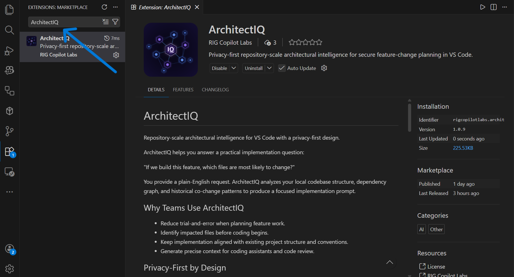
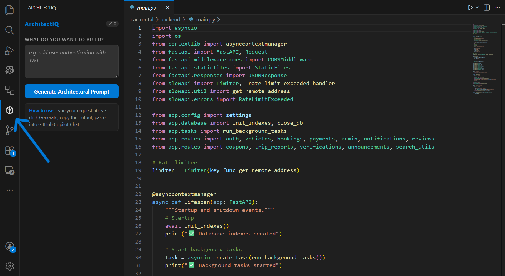
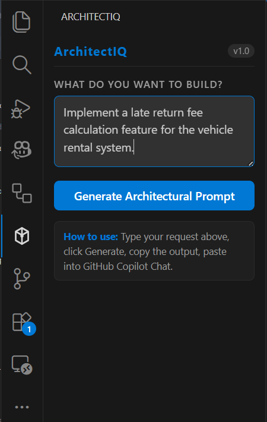
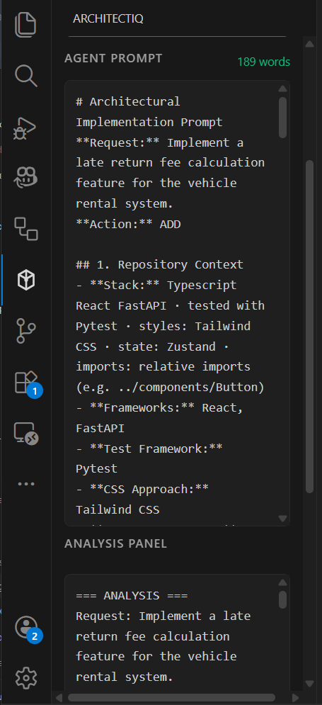
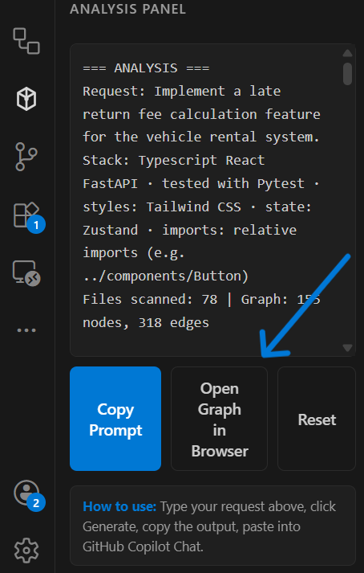
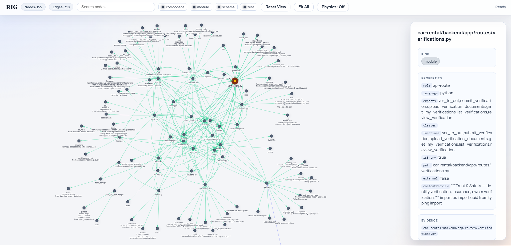
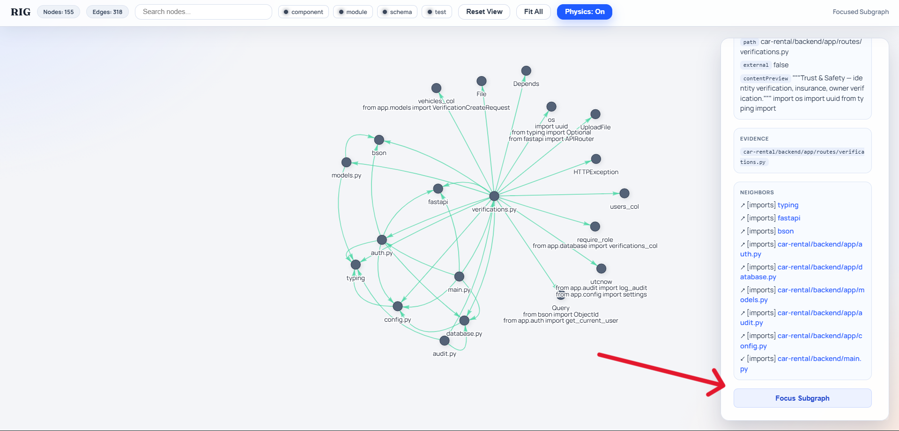
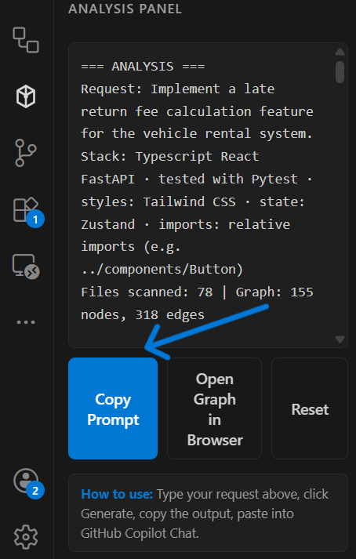

# ArchitectIQ


## Tagline

ArchitectIQ exists to eliminate guesswork in feature delivery by mapping architecture impact before a single line of code is written.

## Product Walkthrough

### Step 1: Find ArchitectIQ in VS Code Extensions

Search for `ArchitectIQ` in the VS Code Extensions marketplace and open the extension details.



### Step 2: Open ArchitectIQ from the Activity Bar

After installation, click the ArchitectIQ icon in the left Activity Bar to launch the extension view.



### Step 3: Enter a Feature Request and Generate

Provide your feature request in the prompt input and click `Generate Architectural Prompt`.



### Step 4: Review Prompt Output and Analysis

Inspect two outputs:
- `Agent Prompt` for downstream coding assistants
- `Analysis Panel` explaining why specific files were selected



### Step 5: Open the Architecture Graph in Browser

Click `Open Graph in Browser` to explore the repository dependency and impact graph.



### Step 6: Explore Interactive Graph Physics

Use node interactions and physics-enabled movement to inspect structural relationships.



### Step 7: Focus on a Targeted Subgraph

Use `Focus Subgraph` to isolate specific nodes and inspect related architecture details.



### Step 8: Copy Prompt and Use with Your Coding Agent

Click `Copy Prompt`, then paste the output into your preferred coding assistant such as GitHub Copilot, Cursor, or Trae.



## Key Features

| Feature | What it does |
|---|---|
| Smart Code Planning | Predicts the files most likely to change for a feature. |
| AI Context Awareness | Understands structure, dependencies, and co-change patterns. |
| Fast Local Execution | Runs inside VS Code using your local repository context. |
| Privacy-First Pipeline | Keeps core analysis on local workspace data. |

## Why This Extension Exists

Most teams start implementation with incomplete impact awareness.
ArchitectIQ was built to answer one critical question early: "what will this feature actually touch?"

## Feature Comparison

| Feature | ArchitectIQ | Generic Copilot Workflow |
|---|---|---|
| Architecture Planning Before Coding | ✅ | ❌ |
| Repository-Scale Impact Mapping | ✅ | ❌ |
| Local Dependency + Co-Change Signals | ✅ | ❌ |
| Privacy-First Local Analysis | ✅ | ⚠️ |

## How It Works

1. Open your repository in VS Code.
2. Open ArchitectIQ from the Activity Bar.
3. Enter your feature request in plain English.
4. Generate an architecture-aware implementation prompt.
5. Build with high-confidence file targets and guidance.

## Installation

1. Open VS Code.
2. Go to Extensions.
3. Search for ArchitectIQ.
4. Click Install.
5. Open your repository and start from the ArchitectIQ view.

## Example

Input request:

```text
add late return fee preview before owner confirms trip closure
```

ArchitectIQ returns:

- likely files to modify
- implementation patterns already used in your repo
- dependency-aware impact hints
- a focused prompt ready for coding assistants

## Command Showcase

```text
Ctrl + Shift + P
> ArchitectIQ: Generate Prompt from Workspace
> ArchitectIQ: Copy Last Generated Prompt
```

## Configuration

- `Privacy model`: local-first repository analysis.
- `Generated artifacts`: `.architectiq/rig.json`, `.architectiq/rig-view.html`.
- `Recommended practice`: ignore generated artifacts if your policy requires clean commits.
- `Security docs`: see `PRIVACY.md` and `SECURITY.md`.

## Roadmap

- Multi-language parser depth expansion
- Richer impact confidence scoring
- Improved monorepo workspace targeting
- Extended architecture graph visualization

## Contributing

We welcome focused contributions in parser support, analysis quality, and UX.
See `CONTRIBUTING.md` for contribution workflow and standards.

## Developed By

Developed by Dhruvin Patel.
